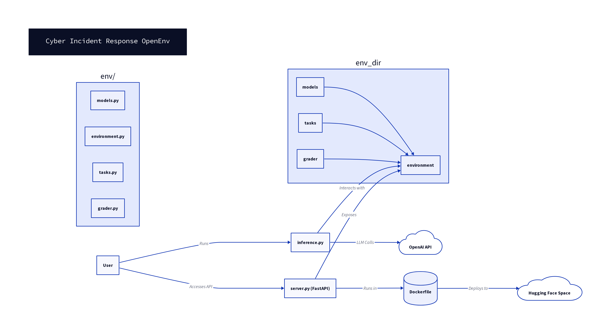

# Cyber Incident Response OpenEnv

## Environment Description

The **Cyber Incident Response OpenEnv** is a simulated environment designed to train and evaluate AI agents as **Blue Team defenders** in a Security Operations Center (SOC) setting. The environment models a small enterprise network, where the agent must detect, investigate, contain, and remediate cyber threats originating from automated **Red Team attacks**.

This simulation supports **long-running multi-step trajectories**, allowing agents to develop sophisticated incident response strategies. It provides a realistic yet controlled setting to test AI capabilities in cybersecurity defense.

## Architecture Diagram

Below is an architectural overview of the Cyber Incident Response OpenEnv project:



## Action and Observation Spaces

The environment utilizes **Pydantic models** for strict type validation of its observation and action spaces, ensuring robust interaction between the agent and the environment.

### Observation Space

Observations provide the agent with critical information about the network state and ongoing threats. Key fields include:

| Field             | Type          | Description                                                      |
| :---------------- | :------------ | :--------------------------------------------------------------- |
| `alerts`          | `List[Alert]` | A list of recent security alerts, including host, severity, and message. |
| `suspected_hosts` | `List[str]`   | Names of hosts currently suspected of being infected.            |
| `infected_estimate`| `int`         | An estimated count of infected hosts in the network.             |
| `time_step`       | `int`         | The current time step in the simulation.                         |
| `network_status`  | `Dict[str, HostStatus]` | Current status of each host in the network (clean, infected, isolated, patched). |

### Action Space

Actions allow the agent to interact with the environment to mitigate threats. Available actions include:

| Action            | Type          | Description                                                      |
| :---------------- | :------------ | :--------------------------------------------------------------- |
| `investigate_host`| `Optional[str]`| Specifies a host to investigate for signs of compromise.         |
| `isolate_host`    | `Optional[str]`| Isolates a specified host from the network to prevent further spread. |
| `patch_host`      | `Optional[str]`| Applies security patches or remediations to a specified host.    |
| `block_ip`        | `Optional[str]`| Blocks a malicious IP address (placeholder for future expansion).|

## Task Descriptions

The environment defines three tasks of increasing difficulty to challenge AI agents:

### Easy Task
*   **Goal**: Contain infection on one host.
*   **`max_steps`**: 10
*   **Scenario**: Phishing Attack

### Medium Task
*   **Goal**: Stop malware lateral movement.
*   **`max_steps`**: 20
*   **Scenario**: Ransomware

### Hard Task
*   **Goal**: Protect critical servers from compromise.
*   **`max_steps`**: 30
*   **Scenario**: Credential Theft

## Reward Explanation

The reward function is designed to shape agent behavior towards effective incident response. Positive rewards are granted for proactive and reactive defensive actions, while penalties are incurred for infection spread and system compromise.

| Event                 | Reward Value | Description                                                      |
| :-------------------- | :----------- | :--------------------------------------------------------------- |
| Investigate Threat    | `+0.1`       | For successfully investigating a suspected host.                 |
| Contain Infection     | `+0.3`       | For isolating an infected host.                                  |
| Patch Vulnerability   | `+0.3`       | For patching a clean host.                                       |
| System Recovery       | `+0.4`       | For patching an isolated host.                                   |
| Infection Spread      | `-0.2`       | Penalty for each instance of malware spreading to a new host.    |
| System Compromise     | `-1.0`       | Severe penalty for critical server (e.g., `db_server`) compromise. |

Final episode scores are normalized between `0.0` (failure) and `1.0` (perfect defense).

## Setup Instructions

To set up and run the Cyber Incident Response OpenEnv locally or deploy it to Hugging Face Spaces, follow these steps:

1.  **Clone the repository** (or create the files as specified):
    ```bash
    git clone <repository_url>
    cd cyber-incident-openenv
    ```

2.  **Install Dependencies**:
    Ensure you have Python 3.8+ and `pip` installed. Then install the required packages:
    ```bash
    pip install -r requirements.txt
    ```

3.  **Environment Variables**:
    Create a `.env` file in the root directory or set the following environment variables:
    *   `API_BASE_URL`: (Optional) Base URL for the OpenAI-compatible API. Defaults to `https://api.openai.com/v1`.
    *   `MODEL_NAME`: (Optional) The name of the LLM model to use for agent actions. Defaults to `gpt-4.1-mini`.
    *   `HF_TOKEN`: Your Hugging Face API token or OpenAI API key, required for LLM calls.
    *   `LOCAL_IMAGE_NAME`: (Optional) For Docker image naming.

    Example `.env` file:
    ```
    API_BASE_URL=https://api.openai.com/v1
    MODEL_NAME=gpt-4.1-mini
    HF_TOKEN=sk-YOUR_OPENAI_API_KEY
    ```

4.  **Run the FastAPI Server (for Hugging Face Spaces deployment)**:
    ```bash
    uvicorn server:app --host 0.0.0.0 --port 7860
    ```
    This will start the API server accessible at `http://0.0.0.0:7860`.

5.  **Run Local Validation**:
    To ensure the environment is correctly set up and passes basic checks:
    ```bash
    python validate_local.py
    ```

6.  **Run Baseline Inference**:
    Execute the `inference.py` script to run the baseline AI agent against the defined tasks and benchmark its performance:
    ```bash
    python inference.py
    ```

## Baseline Benchmark Results

The `inference.py` script runs multiple episodes for each task (easy, medium, hard) and computes key metrics. The expected output format for each task will be:

```
[START] task=easy
[STEP] step=0 reward=0.2
...
[END] task=easy score=0.85
```

After running all tasks, the script will provide mean scores for each task, along with other metrics like success rate, compromise rate, and average steps (though these are not explicitly logged in the current MVP, they can be derived from the `info` dictionary).

### Example Benchmark Output (Illustrative)

```
[START] task=easy
[STEP] step=0 reward=0.10
[STEP] step=1 reward=0.30
[STEP] step=2 reward=0.00
[STEP] step=3 reward=0.40
[END] task=easy score=0.75
[START] task=medium
[STEP] step=0 reward=0.10
[STEP] step=1 reward=-0.20
[STEP] step=2 reward=0.30
[END] task=medium score=0.50
[START] task=hard
[STEP] step=0 reward=0.10
[STEP] step=1 reward=-1.00
[END] task=hard score=0.00
```

These scores represent the average performance of the baseline LLM agent across 5 episodes for each task. Further fine-tuning of the LLM prompt or agent logic can improve these results.

## References

[1] OpenAI API Documentation: [https://platform.openai.com/docs/api-reference](https://platform.openai.com/docs/api-reference)
[2] FastAPI Documentation: [https://fastapi.tiangolo.com/](https://fastapi.tiangolo.com/)
[3] Pydantic Documentation: [https://pydantic-docs.helpmanual.io/](https://pydantic-docs.helpmanual.io/)
[4] Hugging Face Spaces: [https://huggingface.co/docs/hub/spaces](https://huggingface.co/docs/hub/spaces)
